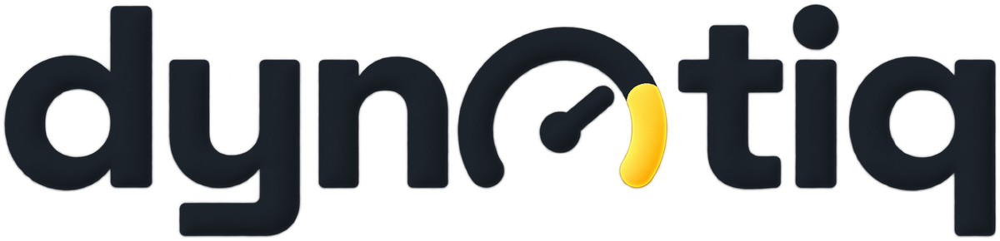

<picture>
  <source media="(prefers-color-scheme: dark)" srcset="icons/wordmark/png/dynotiq-wordmark-dark-w1200.png">
  
</picture>

**System diagnostics and tuning for Ubuntu**

One GTK4 application that finds what slows a machine down, explains every
finding in plain language and offers the matching fix.
Nothing runs without asking first.

[**Download the latest release**](https://github.com/simonlinuxcraft/dynotiq/releases/latest)

## What it does

**System check** scans for outdated graphics drivers, thermal throttling, full
filesystems, a growing journal, failed units, startup entries and pending
updates. Every finding says what is wrong, why it matters and what to do about
it, and where the app can act on it, the finding leads to the page that does.

**Incidents** reads the journal for audio dropouts, GPU driver errors,
out-of-memory kills and failed systemd units. Each entry records temperature,
clock and load at that moment, so a bare error message turns into a connection.

**Updates** brings apt, Snap, Flatpak and firmware together, with download
sizes, per-entry selection, a live log and an optional Timeshift snapshot
beforehand. Afterwards it verifies which entries actually went through.

**App check** takes an installed application apart: where its updates come
from, how much it occupies in your home directory and how much of that is pure
cache, unresolved libraries, disconnected Snap interfaces, missing Flatpak
permissions, crashes, journal errors. Technical terms get translated, so
`audio-record` reads as microphone. Where a fix exists, there is a button.

**Games** checks what actually bites while playing: shader caches and their
limits, the Proton build a title is set to, launch options, ntsync, Resizable
BAR, titles pointing at a Proton build that is no longer installed, and prefixes
left behind by games you uninstalled long ago.

**Proton** is where a Windows game that stopped starting gets explained. Every
Proton version from 5.13 on runs inside a container Steam downloads separately,
and when that container is missing or damaged, no game starts on that version
while Steam says nothing beyond "exited unexpectedly". The page reads Steam's
own files, names the cause, and carries a button for it: fetch the runtime
again, take out an assignment that breaks it, move a version Steam never looks
at into the folder it does read, or switch a title to a Proton version its
Windows store actually fits.

**Dyno** records temperature, clock and waiting times over minutes under real
load and answers what a snapshot cannot: at which point does it start
throttling, and did the machine ever stand still waiting for a free core, for
memory or for the disk. The last part matters because stutter without any heat
looks like nothing at all in a temperature curve.

**Benchmark** measures CPU, memory and disk against the median of your own
earlier runs. A number without a baseline says nothing.

**Settings** keeps the background watcher on a leash: how often it looks, and
whether it interrupts for anything below a critical incident. Everything can go
back to the defaults in one step, and history and snoozed findings survive that.

Plus a driver page, a live monitor, storage analysis with cleanup, autostart
control including slow boot services, and a history of every scan.

## Ubuntu for now

dynotiq is built and tested on Ubuntu 24.04 and newer. It leans on apt, dpkg,
snap and Ubuntu specifics such as the HWE kernel stack and `do-release-upgrade`,
so on other distributions parts of it will report nothing useful. Support for
further distributions is planned.

## Install

From the apt repository, which also keeps it updated:

    curl -fsSL https://simonlinuxcraft.github.io/dynotiq/dynotiq.gpg | sudo tee /usr/share/keyrings/dynotiq.gpg > /dev/null
    printf 'Types: deb\nURIs: https://simonlinuxcraft.github.io/dynotiq\nSuites: ./\nSigned-By: /usr/share/keyrings/dynotiq.gpg\n' | sudo tee /etc/apt/sources.list.d/dynotiq.sources > /dev/null
    sudo apt update
    sudo apt install dynotiq

Or download the `.deb` from the
[latest release](https://github.com/simonlinuxcraft/dynotiq/releases/latest)
and install it directly. The package carries the repository and its key, so
updates arrive through apt either way. GitHub replaces the tilde in the version
with a dot in the attachment name, the package itself is unaffected:

    sudo dpkg -i dynotiq_0.3.beta_all.deb

Build the package yourself:

    ./build-deb.sh
    sudo dpkg -i build/dynotiq_0.3~beta_all.deb

Or run it from the source tree without installing:

    python3 dynotiq.py

## Updates

The package carries its own apt source and signing key, so updates arrive
through `apt upgrade` like for any other package, however it was installed. The
system check also reports a new version on its own, with a button that runs the
apt install after asking for your password. Nothing is downloaded or installed
without that click. Remove the source and the check says so, with the commands
to put it back.

The repository is served from GitHub Pages and holds binary packages only. It
is flat, one package for every Ubuntu release, because dynotiq is
`Architecture: all` and pure Python.

To publish a new version, bump `VERSION` in `dynotiq.py` and `debian/changelog`
to the same number, then:

    ./build-repo.sh      # builds the .deb, indexes and signs the repository
    ./publish-repo.sh    # pushes build/repo to the gh-pages branch

The `dpkg -i` line under Install names the file attached to the release, so it
is bumped once that release exists, not before. Bumped earlier it points at a
download nobody can fetch.

`build-repo.sh` never publishes, that stays a separate step. It needs
`dpkg-dev`, `apt-utils` and `gettext`, plus the GPG key the repository is
signed with. `publish-repo.sh` replaces the `gh-pages` branch outright; it
carries build artefacts only, the sources live in `main`.

Versions carry the Ubuntu release rather than the series name, so
`0.3~beta~ubuntu24.04.1` sorts below `0.3~beta~ubuntu26.04.1`. Series names
cycle back through the alphabet, which would eventually make a newer Ubuntu look
older to apt. A tilde sorts below everything, which is what makes `0.3~beta`
an upgrade from `0.1` and still a downgrade from the final `0.2`. Git refuses a
tilde in tag names, so the matching tag is written `v0.3-beta`.

## Requirements

`python3-gi`, `python3-gi-cairo` and `gir1.2-gtk-4.0`. Recommended:
`librsvg2-bin` for tray icons, `pkexec` to apply fixes, `fonts-inter` for the
interface font.

## Languages

German and English. The interface follows your desktop language and falls back
to German. To force one:

    LANGUAGE=en dynotiq

Catalogues live in `po/`, `build-deb.sh` compiles them into the package.

## Command line

| Option | Effect |
| --- | --- |
| `dynotiq` | open the window |
| `dynotiq --page Updates` | open on a specific page |
| `dynotiq --watch` | background service, reports new incidents |
| `dynotiq --install` | place icons and a launcher for the current user |
| `dynotiq --selftest` | run the built-in checks |
| `dynotiq --version` | print the version and exit |

## Contributing

Pull requests are welcome. A few things make them easy to merge:

- **Open an issue first** for anything larger than a fix. It saves you from
  building something that does not fit, and it saves me from turning it down
  after the fact.
- **The selftest has to pass.** `python3 dynotiq.py --selftest` runs the whole
  suite in a few seconds, and CI runs it on every push. Logic that can break
  brings its own assertion along.
- **Match the surrounding code.** One file, plain GTK4, no new dependencies
  without a reason. Comments explain why, not what.
- **User-visible strings are translatable.** Wrap them in `_()`, then run
  `./update-po.sh` and fill in the English catalogue.

Bug reports and ideas are just as welcome as code. If you send a patch, you
send it under the same licence as the rest of the project.

## Licence

Copyright (C) 2026 Simon Gettkandt (simonlinuxcraft)

dynotiq is free software under the **GNU General Public License, version 3 or
later**. You may use, study, share and modify it, and the same freedoms travel
with every copy you pass on. The full text is in [LICENSE](LICENSE).

It comes with no warranty, to the extent permitted by law.
